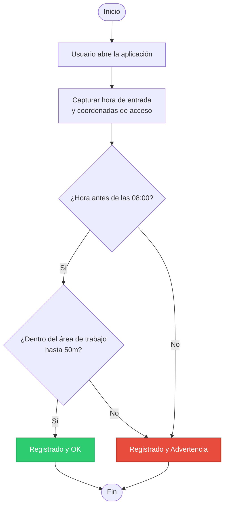

```mermaid
flowchart TD
    A([Inicio]) --> B[Usuario abre la aplicación]
    B --> C["Capturar hora de entrada<br>y coordenadas de acceso"]
    C --> D{"¿Hora antes de las 08:00?"}
    D -->|Sí| E{"¿Dentro del área de trabajo<br>hasta 50m?"}
    D -->|No| G["Registrado y Advertencia"]
    E -->|Sí| F["Registrado y OK"]
    E -->|No| G
    F --> H([Fin])
    G --> H

    classDef ok fill:#2ecc71,stroke:#27ae60,color:#fff,stroke-width:2px
    classDef Advertencia fill:#e74c3c,stroke:#c0392b,color:#fff,stroke-width:2px
    class F ok
    class G Advertencia
```
